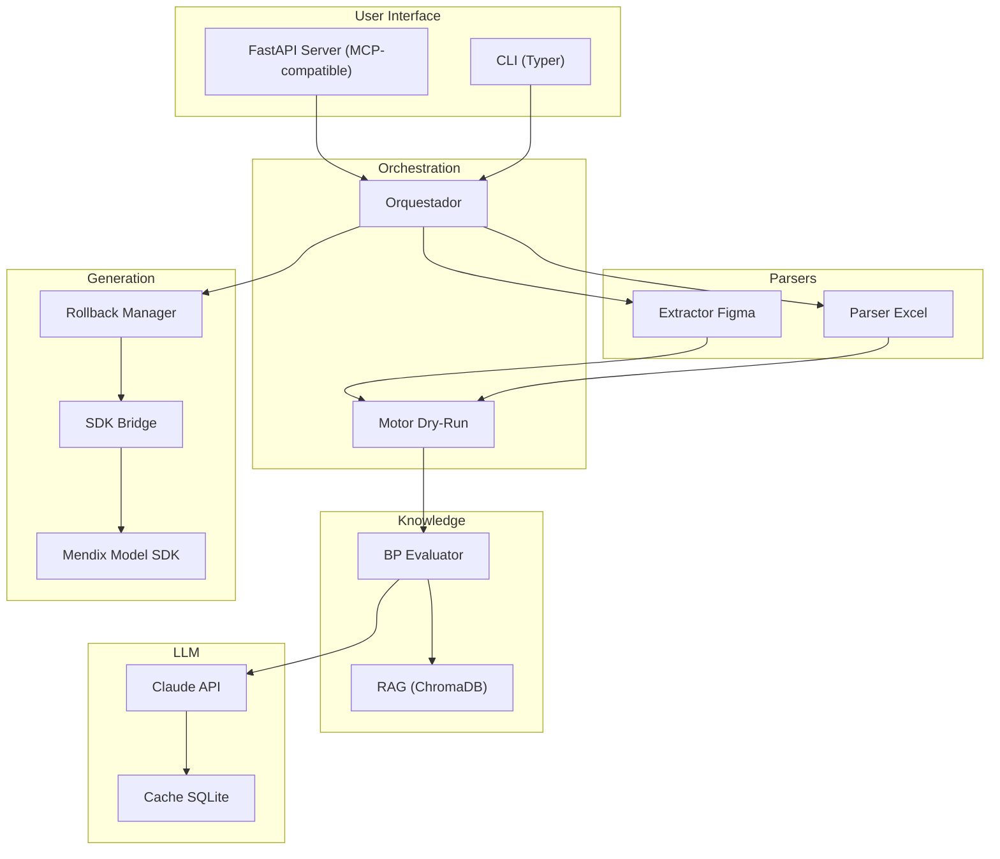

# MendixFormAgent

> Agente de IA para automatizar la generacion de formularios en Mendix 10.24

[](https://python.org)
[](https://mendix.com)
[](LICENSE)

---

## Descripcion

MendixFormAgent es un agente de IA externo (fuera de Mendix Studio Pro) que automatiza
las tareas mas tediosas del desarrollo en Mendix 10.24.16 LTS. Acepta multiples fuentes
de input (Excel o Figma) y genera artefactos Mendix completos y validados:

- **Entidades** en el Domain Model con atributos y tipos correctos
- **Asociaciones** entre entidades (1-*, *-*, 1-1) con cascade delete y ownership
- **Paginas de formulario** (Create/Edit) con widgets reales (DataView, TextBox, CheckBox, DataGrid, etc.)
- **Paginas Overview** con DataGrid, columnas y botones de accion
- **Microflows** con actividades reales (Commit, Delete, Retrieve, Validate, ClosePage, etc.)
- **Reglas de acceso** basicas por rol

Todo validado contra las **buenas practicas oficiales de Mendix** y **convenciones de naming** antes de aplicar cambios.

### Motivacion

El desarrollo manual de formularios en Mendix implica crear repetidamente entidades,
paginas, microflows y reglas de acceso. Este proceso es tedioso, propenso a errores
y a inconsistencias con las mejores practicas. MendixFormAgent automatiza este flujo
completo con un pipeline: **Input → Validacion BP → Preview → Generacion**.

---

## Arquitectura



---

## Requisitos Previos

| Requisito | Version | Notas |
|---|---|---|
| **Python** | >= 3.11 | [python.org](https://python.org) |
| **Node.js** | >= 18 LTS | [nodejs.org](https://nodejs.org) |
| **Mendix Studio Pro** | 10.24.16 LTS | Para abrir los .mpr generados |
| **API Key Anthropic** | — | [console.anthropic.com](https://console.anthropic.com) |
| **Cuenta Figma** | — | Opcional. Solo si se usa input desde Figma |

---

## Instalacion

### 1. Clonar el repositorio

```bash
git clone https://github.com/EnzoOrdonez/Mendix-Builder-Prototype.git
cd Mendix-Builder-Prototype
```

### 2. Ejecutar setup

**Windows (PowerShell):**
```powershell
.\scripts\setup.ps1
```

**Linux/macOS/Git Bash:**
```bash
chmod +x scripts/setup.sh
./scripts/setup.sh
```

**O manualmente:**
```bash
pip install -e ".[dev]"
cd mendix_sdk && npm install && npm run build && cd ..
```

### 3. Configurar variables de entorno

```bash
cp .env.example .env
# Editar .env con tus API keys
```

### 4. Configurar ExecutionPolicy (Windows)

En PowerShell (solo si no se ha hecho antes):

```powershell
Set-ExecutionPolicy RemoteSigned -Scope CurrentUser
```

### 5. Verificar instalacion

```bash
python -m mendex --help
node mendix_sdk/dist/index.js --ping
```

### 6. Agregar proyecto Mendix de referencia (opcional)

Copiar **solo el archivo `.mpr`** (no la carpeta completa) a `reference_project/`:

```bash
# El archivo .mpr esta en .gitignore, nunca se sube a GitHub
cp /ruta/a/tu/Proyecto.mpr reference_project/
```

Luego extraer convenciones:

```bash
python -m mendex refresh-conventions --mpr reference_project/Proyecto.mpr
```

---

## Variables de Entorno

| Variable | Descripcion | Requerida |
|---|---|---|
| `ANTHROPIC_API_KEY` | API Key de Anthropic (Claude) | Si |
| `MENDIX_TOKEN` | Token de la plataforma Mendix | Si |
| `FIGMA_ACCESS_TOKEN` | Personal Access Token de Figma | No |
| `LLM_MODEL` | Modelo de Claude a usar (default: `claude-sonnet-4-5-20250514`) | No |
| `HOST` | Host del servidor REST (default: `127.0.0.1`) | No |
| `PORT` | Puerto del servidor REST (default: `8000`) | No |
| `CACHE_TTL_DAYS` | Dias de vida del cache LLM (default: `7`) | No |
| `LOG_LEVEL` | Nivel de logging (default: `INFO`) | No |
| `MAX_BACKUPS` | Numero maximo de backups del .mpr (default: `5`) | No |

---

## Uso

### Generar formulario desde Excel (dry-run por defecto)

```bash
mendex generate --input formulario.xlsx --mpr proyecto.mpr
```

### Generar formulario desde Figma (dry-run por defecto)

```bash
mendex generate --input "https://www.figma.com/file/ABC123/Diseno?node-id=1:2" --mpr proyecto.mpr
```

### Generar sin confirmacion y sobrescribir existentes

```bash
mendex generate --input formulario.xlsx --mpr proyecto.mpr --no-confirm --on-conflict=overwrite
```

### Auditar proyecto existente contra buenas practicas

```bash
mendex audit --mpr proyecto.mpr
```

### Refrescar convenciones desde proyecto de referencia

```bash
mendex refresh-conventions --mpr reference_project/COPEINCA.mpr
```

### Modo estricto (aborta si hay NO_CONFORME)

```bash
mendex generate --input formulario.xlsx --mpr proyecto.mpr --strict
```

### Iniciar servidor REST

```bash
mendex serve --port 8000
```

### Gestion del cache LLM

```bash
mendex cache stats
mendex cache clear --yes
```

### Log de decisiones

```bash
mendex log show --last 10
mendex log show --output json
mendex log tokens
mendex log clear --yes
```

### Auditar con solo reglas deterministas (sin LLM)

```bash
mendex audit --mpr proyecto.mpr --no-bp
```

### Salida JSON para integracion CI/CD

```bash
mendex audit --mpr proyecto.mpr --output json --no-bp
```

### Generar plantilla Excel pre-formateada

```bash
mendex init-excel --module Operaciones --entities 3 --output mi_proyecto.xlsx
```

Genera un `.xlsx` con headers, dropdowns de validacion, hojas `_Relaciones` y `_Seguridad`, y filas de ejemplo.

### Validar schema (sin generar)

```bash
mendex validate --input formulario.xlsx --conventions --module Operaciones
```

Valida cross-references entre entidades/paginas/microflows y naming conventions (PascalCase, prefijos de microflow, etc.).

### Validar solo naming conventions

```bash
mendex validate-conventions --input formulario.xlsx
```

---

## Interpretar el Reporte de Dry-Run

Cuando ejecutas `mendex generate`, el agente muestra un preview antes de aplicar cambios:

```
=== MendixFormAgent — Dry-Run Report ===

Artefactos a generar: 3 entidades, 3 paginas, 6 microflows

[1] Entity "OrdenCompra" en modulo "Operaciones"
    BP Naming:       CONFORME    (PascalCase, cumple BP oficial)
    BP Access Rules: NO_CONFORME (sin reglas de acceso — BP requiere explicit access rules)
      → Recomendacion: Agregar AccessRule con deny-by-default
    Colision:        Ninguna

[2] Page "OrdenCompra_NewEdit" en modulo "Operaciones"
    BP Naming:       CONFORME
    Colision:        Ninguna

Resumen: 5 CONFORME | 1 NO_CONFORME | 0 SIN_DATOS

¿Confirmar ejecucion? [y/N]:
```

---

## Interpretar decisions.jsonl

Cada decision del agente se registra en `logs/decisions.jsonl`:

```json
{
  "timestamp": "2026-01-15T10:30:00Z",
  "operation": "bp_evaluation",
  "input_hash": "abc123...",
  "bp_verdict": "NO_CONFORME",
  "pattern_source": "official_bp",
  "action_taken": "warning_emitted",
  "warnings": ["Entity lacks explicit access rules"],
  "llm_model": "claude-sonnet-4-5-20250514",
  "llm_tokens_used": 1250,
  "cache_hit": false
}
```

Util para: auditar decisiones, depurar comportamientos inesperados, calcular costos de API.

---

## Configurar Layers en Figma

Para que el extractor de Figma funcione, los layers deben seguir convenciones de naming.
Ver la guia completa en [`docs/figma_naming_conventions.md`](docs/figma_naming_conventions.md).

Resumen rapido:
- Frame principal: `form_{NombreEntidad}`
- Campos: `input_{NombreCampo}_{tipo}` (tipos: text, number, decimal, date, bool, enum)
- Labels: `label_{NombreCampo}`
- Botones: `btn_{Accion}`
- Grupos: `group_{NombreSeccion}`

---

## Tests

```bash
pytest tests/ -q              # Todos (773+ tests)
pytest tests/unit/ -q         # Unitarios (rapidos, sin dependencias)
pytest tests/integration/ -q  # Integracion (MockSDKClient, fixtures)
pytest tests/ --cov=src/mendex --cov-report=html  # Con cobertura
```

Ver guia completa de pruebas (incluyendo pruebas reales con Mendix Studio Pro) en [`docs/TESTING.md`](docs/TESTING.md).

---

## Estructura del Proyecto

```
mendex-agent-prototype/
├── src/mendex/              # Agente Python principal
│   ├── cli/                 # CLI con Typer
│   ├── server/              # FastAPI REST (MCP-compatible)
│   ├── orchestrator/        # Pipeline de orquestacion
│   ├── schema/              # IntermediateSchema (contrato de datos)
│   ├── parsers/             # Excel parser + Figma extractor
│   ├── knowledge/           # RAG de BP + convenciones
│   ├── llm/                 # LLMProvider + cache SQLite
│   ├── bridge/              # SDK bridge + rollback
│   ├── generators/          # Generadores de entidades/paginas/microflows
│   ├── validators/          # Validadores post-generacion y convenciones
│   ├── templates/           # Generador de plantilla Excel
│   ├── auditor/             # Motor de auditoria
│   ├── logging/             # Logger estructurado
│   └── config/              # Settings (pydantic-settings)
├── mendix_sdk/              # Modulo Node.js (Mendix Model SDK)
│   └── src/handlers/        # Handlers TypeScript (entity, page, microflow, association)
├── knowledge_base/          # BP oficiales + vector store
├── conventions/             # copeinca_conventions.yaml
├── reference_project/       # Proyecto COPEINCA (gitignored)
├── cache/                   # Cache LLM SQLite (gitignored)
├── logs/                    # Logs estructurados (gitignored)
├── tests/                   # Unit, integration, e2e
├── fixtures/                # Datos de prueba (Excel, scripts)
├── docs/                    # Documentacion tecnica
└── scripts/                 # Setup y utilidades
```

---

## Mejoras v2

- Widgets reales en paginas (DataView, TextBox, CheckBox, DatePicker, DataGrid, ReferenceSelector, etc.)
- Actividades reales en microflows (Commit, Delete, Retrieve, Change, MicroflowCall, ClosePage, ShowMessage, Validation)
- Asociaciones en domain model (1-*, *-*, 1-1, cascade delete, ownership)
- Validacion post-generacion de cross-references (entidades, paginas, microflows, botones)
- Validacion de naming conventions (PascalCase, prefijos ACT/VAL/DS/SUB, sufijos de pagina)
- Plantilla Excel con dropdowns y validacion (`mendex init-excel`)
- Sugerencias fuzzy para errores de tipeo en columnas y tipos de dato
- 773+ tests automatizados (unitarios, integracion, E2E round-trip)

---

## Roadmap

- [x] **Fase 0**: Setup, scaffolding y configuracion base
- [x] **Fase 1**: Sistema de rollback / backup del .mpr
- [x] **Fase 2**: Logger estructurado y cache LLM
- [x] **Fase 3**: Extractor de convenciones COPEINCA
- [x] **Fase 4**: Pipeline RAG con BP oficiales
- [x] **Fase 5**: Motor de dry-run e idempotency checker
- [x] **Fase 6**: Parser Excel → IntermediateSchema
- [x] **Fase 7**: Extractor Figma → IntermediateSchema
- [x] **Fase 8**: Generador de Domain Model via Model SDK
- [x] **Fase 9**: Generador de paginas y microflows
- [x] **Fase 10**: Motor de auditoria de BP
- [x] **Fase 11**: Servidor REST FastAPI (MCP-compatible)
- [x] **Fase 12**: CLI completa con todos los flags
- [x] **Fase 13**: Tests de integracion + proyecto Mendix demo
- [x] **Fase 14**: v2 — Widgets reales, actividades, asociaciones, validadores y plantilla Excel

---

## Que se Commitea y Que No

| Archivo/Carpeta | Se commitea | Razon |
|---|---|---|
| `conventions/copeinca_conventions.yaml` | Si | Patrones de estructura, no datos sensibles |
| `conventions/copeinca_conventions.schema.json` | Si | Esquema de validacion |
| `knowledge_base/mendix_bp_official/*.md` | Si | Documentacion publica de Mendix |
| `reference_project/*.mpr` | **No** | Datos sensibles del proyecto real |
| `cache/llm_responses.db` | **No** | Local por developer |
| `logs/decisions.jsonl` | **No** (por defecto) | Opcionalmente activable para auditoria compartida |
| `*.mpr.backup.*` | **No** | Backups temporales |
| `knowledge_base/chroma_db/` | **No** | Se regenera localmente |
| `.env` | **No** | Contiene API keys |

Para activar tracking de logs: remover `logs/` del `.gitignore`.

---

## Migracion a Mendix 11

La arquitectura esta preparada para migrar a Mendix 11.12 MTS (junio 2026) con cambios minimos,
gracias a tres abstracciones clave:

- **LLMProvider**: Intercambiable entre Claude directo y Mendix AI Gateway
- **SDKClient**: Intercambiable entre subprocess Node.js y Agents Kit nativo
- **KnowledgeProvider**: Intercambiable entre ChromaDB local y Agent Commons

Ver detalles en [`docs/migration_mendix11.md`](docs/migration_mendix11.md).

---

## Licencia

[MIT](LICENSE)
