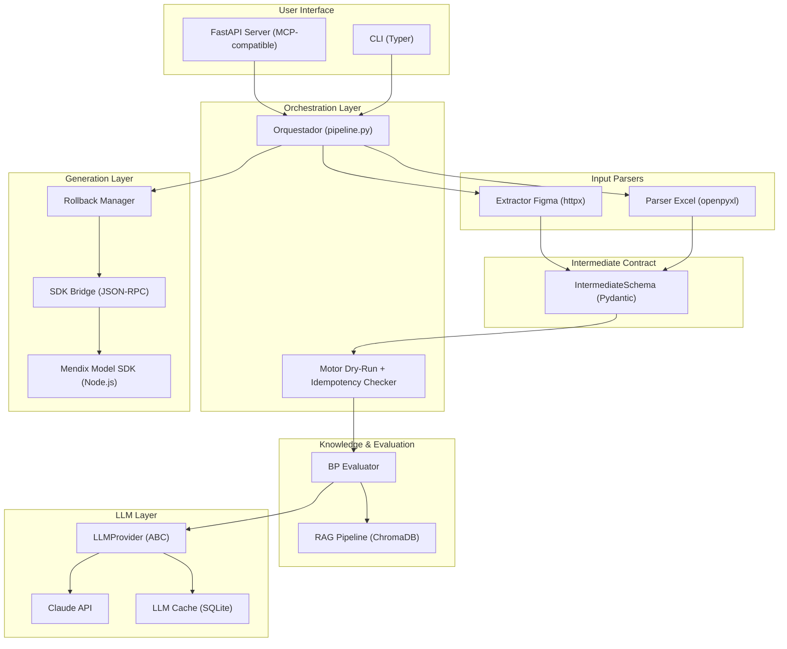

# Arquitectura — MendixFormAgent

## Diagrama de Componentes

```mermaid
graph TB
    subgraph "User Interface"
        CLI["CLI (Typer)"]
        REST["FastAPI Server (MCP-compatible)"]
    end

    subgraph "Orchestration Layer"
        ORCH["Orquestador (pipeline.py)"]
        DRYRUN["Motor Dry-Run + Idempotency Checker"]
    end

    subgraph "Input Parsers"
        EXCEL["Parser Excel (openpyxl)"]
        FIGMA["Extractor Figma (httpx)"]
    end

    subgraph "Intermediate Contract"
        SCHEMA["IntermediateSchema (Pydantic)"]
    end

    subgraph "Knowledge & Evaluation"
        RAG["RAG Pipeline (ChromaDB)"]
        EVAL["BP Evaluator"]
    end

    subgraph "LLM Layer"
        LLM["LLMProvider (ABC)"]
        CLAUDE["Claude API"]
        CACHE["LLM Cache (SQLite)"]
    end

    subgraph "Generation Layer"
        BRIDGE["SDK Bridge (JSON-RPC)"]
        SDK["Mendix Model SDK (Node.js)"]
        ROLLBACK["Rollback Manager"]
    end

    CLI --> ORCH
    REST --> ORCH
    ORCH --> EXCEL
    ORCH --> FIGMA
    EXCEL --> SCHEMA
    FIGMA --> SCHEMA
    SCHEMA --> DRYRUN
    DRYRUN --> EVAL
    EVAL --> RAG
    EVAL --> LLM
    LLM --> CACHE
    LLM --> CLAUDE
    ORCH --> ROLLBACK
    ROLLBACK --> BRIDGE
    BRIDGE --> SDK
```

Ver el plan completo en `docs/` y el README.md para detalles de cada componente.
